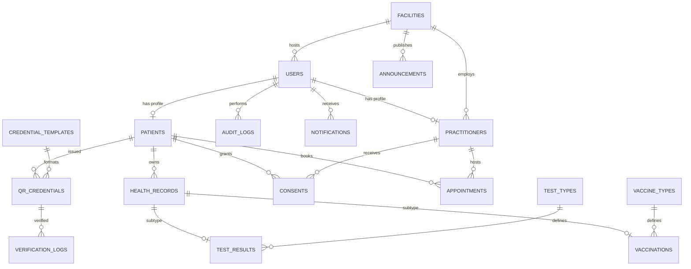
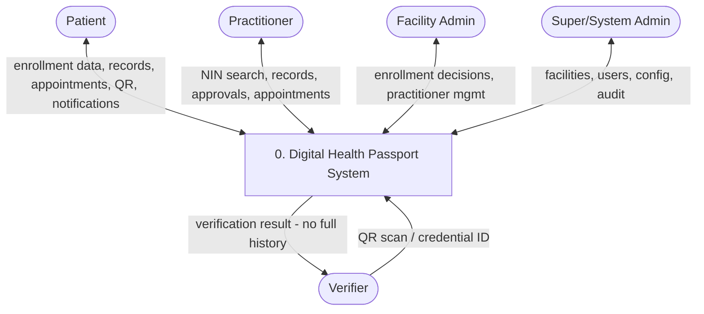
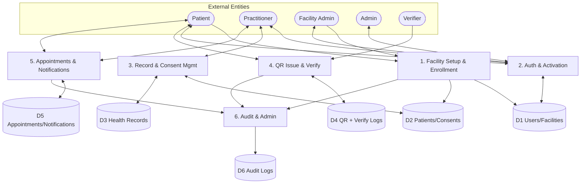
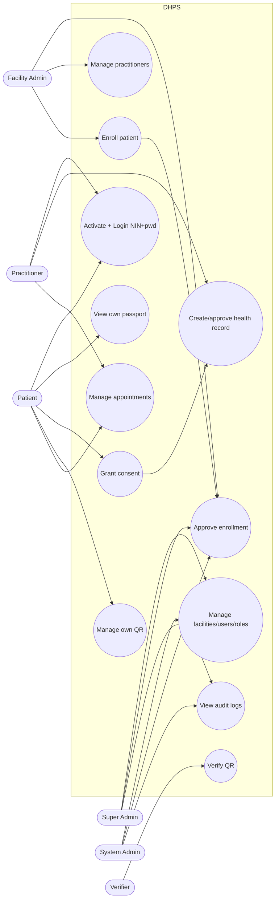

# Digital Health Passport System — System Design Artefacts

**Source:** `docs/System Design & Requirements Document.md` v1.0 (2025–2026)
**Stack:** Laravel, PHP 8.x, MySQL 8.x, Blade, Tailwind CSS, Alpine.js
**Methodology:** Rapid Application Development (RAD)

This file contains the system modules, functional and non-functional requirements,
ERD, DFD Level 0 and Level 1, and Use Case diagrams in Mermaid + tables,
suitable for pasting into the MUBAS report.

---

## 1. System Modules

Derived from workflow steps 1–14 and the layered MVC + service architecture.

| # | Module | Covers | Key actors |
|---|--------|--------|------------|
| M1 | Facility Setup & User Management | Register facilities, create admin / practitioner accounts, manage roles and permissions | Super Admin, System Admin, Facility Admin |
| M2 | Patient Enrollment & Approval | NIN capture + dedup check, demographics / contact capture, ID document verification, Pending → Approved / Rejected | Enrolling staff, Facility Admin |
| M3 | Authentication & Account Activation | Activation, NIN + Password login, optional 2FA, password reset, lockout, session timeout | All authenticated users |
| M4 | Patient Health Passport | View personal info, vaccination history, lab results, certificates, appointments, notifications, QR | Patient, Practitioner (with consent) |
| M5 | Clinical Records & Consent | Create / approve `health_records`, `vaccinations`, `test_results`, consent grant / check | Practitioner, Patient |
| M6 | QR Credential & Verification | Signed-token generation, view / share / print / revoke, scan / manual verify, expiry check | Patient, Verifier |
| M7 | Appointment Management | Book / reschedule / cancel, schedule management, status updates | Patient, Practitioner |
| M8 | Notifications & Reference Data | Enrollment, record, appointment, password, expiry events; vaccine / test types, credential templates, announcements | System (auto), Admins |
| M9 | Audit & Security Admin | Login attempts, enrollment / record / credential events, backups, security policies | Super Admin, System Admin |
| M10 | Dashboards & Verifier Portal | Role dashboards, public landing page, QR scanner portal | All roles, Verifier (public) |

Service-layer mapping: Enrollment Service, NIN Lookup Service, Credential Service,
Verification Service, Audit Service, Notification Service.

---

## 2. Functional Requirements

### M2 — Enrollment & Approval

| ID | Requirement |
|----|-------------|
| FR-1 | System shall capture NIN, personal information, contact information and ID reference at a registered facility. |
| FR-2 | System shall reject duplicate NIN via keyed HMAC-SHA256 lookup; displayed NIN shall be masked (last 4 digits only). |
| FR-3 | New enrollments shall enter `Pending Approval` state. |
| FR-4 | Facility Admin shall approve / reject with reason; every decision is audit-logged and notified to the patient. |

### M3 — Authentication

| ID | Requirement |
|----|-------------|
| FR-5 | Patient shall activate via provided mechanism, set a personal password, optionally configure 2FA. |
| FR-6 | Login shall use NIN + password, enforce rate limiting and lockout, then redirect to the role dashboard. |

### M4 / M5 — Records & Consent

| ID | Requirement |
|----|-------------|
| FR-7 | Patient shall view only own records: info, vaccinations, labs, certificates, appointments, notifications, QR. |
| FR-8 | Practitioner shall search by NIN; system shall enforce consent / authorization before record access and log the access event. |
| FR-9 | Practitioner shall create vaccination / lab / certificate records; records may pend approval, then become passport-visible with author + timestamp. |
| FR-10 | Patient shall grant / revoke consent to practitioners. |

### M6 — QR Credential

| ID | Requirement |
|----|-------------|
| FR-11 | System shall generate a signed-token QR (not full history); patient can view / share / print / revoke; credentials may expire. |
| FR-12 | Verifier shall scan or enter credential ID; system validates signature / status / expiry and returns only holder name, type, validity, expiry, issuer; each verification is logged. Expired / revoked = reject. |

### M7 — Appointments

| ID | Requirement |
|----|-------------|
| FR-13 | Patient can view / book / reschedule / cancel appointments; practitioner manages schedules and statuses. |

### M8 — Notifications

| ID | Requirement |
|----|-------------|
| FR-14 | System shall notify on: enrollment decision, activation, new record, appointment, password change, QR expiry. |

### M9 — Audit & RBAC

| ID | Requirement |
|----|-------------|
| FR-15 | System shall log: logins, enrollment, record create / modify / approve, QR generation / verification, account changes — with user + timestamp. |
| FR-16 | RBAC matrix shall be enforced server-side (UI hiding alone is not security). See table below. |

RBAC (summary):

| Function | Super Admin | System Admin | Facility Admin | Practitioner | Patient | Verifier |
|---|:-:|:-:|:-:|:-:|:-:|:-:|
| Manage system security | ✓ | | | | | |
| Manage users | ✓ | ✓ | ✓ | | | |
| Approve enrollment | ✓ | ✓ | ✓ | | | |
| Manage practitioners | | | ✓ | | | |
| Create health records | | | | ✓ | | |
| View own records | | | | | ✓ | |
| Approve health records | | | | ✓ | | |
| Manage own QR | | | | | ✓ | |
| Verify QR | | | | | | ✓ |
| View audit logs | ✓ | ✓ | Limited | | | |
| Manage appointments | | | | ✓ | ✓ | |

---

## 3. Non-Functional Requirements

| Category | Requirement |
|----------|-------------|
| Security | HTTPS, secure password hashing, RBAC + server-side authorization, NIN HMAC protection, input validation, CSRF / XSS (Blade escaping) / SQLi (Eloquent) protection, secure QR tokens, secure uploads, login rate limit + lockout, session timeout |
| Privacy | Minimum-necessary disclosure; verifier receives no full medical history |
| Accessibility | Accessible via modern web browsers |
| Responsiveness | Mobile-first; works on desktop, tablet, mobile |
| Performance | Core pages and patient search respond within acceptable time at student scale |
| Reliability | DB transactions protect multi-step operations; backups |
| Usability | Simple role-appropriate interfaces; SUS evaluation |
| Auditability | Important activities recorded with user + timestamp |
| Maintainability | Laravel conventions, services, migrations, PHPUnit + Dusk, Git |
| Compatibility | Current major browsers |

---

## 4. ERD



Data dictionary (per §7):

- `users(id, nin_hash, nin_last4, full_name, dob, gender, phone, email, password, status, facility_id, enrollment_info, approval_info)`
- `facilities(id, name, type, location)`
- `practitioners(id, user_id, facility_id, licence_no, specialty)`
- `patients(id, user_id)`
- `health_records(id, patient_id, type, author_id, status, timestamps)`
- `vaccinations(id, health_record_id, vaccine_type_id, dose, date, next_due)`
- `test_results(id, health_record_id, test_type_id, result, date)`
- `qr_credentials(id, patient_id, template_id, token, status, expiry)`
- `verification_logs(id, credential_id, verifier_info, result, timestamp)`
- `consents(id, patient_id, practitioner_id, scope, status)`
- `appointments(id, patient_id, practitioner_id, datetime, status)`
- `notifications(id, user_id, type, message, read_at)`
- `audit_logs(id, user_id, action, entity, timestamp)`
- Reference: `vaccine_types`, `test_types`, `credential_templates`, `announcements`

Relationships (per §8): one User → one Patient/Practitioner profile; one Patient → many Health Records / QR credentials / Appointments / Consents; one QR → many verifications; one Facility → many Users; one User → many audits. PK/FK + unique + indexes enforce integrity.

---

## 5. DFD Level 0 (Context Diagram)



| Flow | Description |
|------|-------------|
| Patient ↔ System | Enrollment request, activation, records view, QR handling, appointments, notifications |
| Practitioner ↔ System | NIN search, consent-checked record access, record create / approve, appointments |
| Facility Admin ↔ System | Pending queue review, approve / reject + reason, practitioner management |
| Super / System Admin ↔ System | Facilities, accounts, reference data, backups, audit logs |
| Verifier → System | QR scan / manual ID |
| System → Verifier | Validity + holder name + type + expiry + issuer only |

---

## 6. DFD Level 1 (Decomposition)



| Process | Inputs | Outputs | Stores |
|---------|--------|---------|--------|
| 1. Facility Setup & Enrollment | Facility details, NIN + demographics, approval decision | Facility record, Pending enrollment, Approved/Rejected + notification | D1, D2, D6 |
| 2. Auth & Activation | NIN + password, activation token, 2FA | Session + role dashboard, lockout, reset | D1, D6 |
| 3. Record & Consent Mgmt | NIN search, consent grant, record payload, approval | Consent-checked record view, pending → approved record | D2, D3, D6 |
| 4. QR Issue & Verify | Issue / revoke request, scan / manual ID | Signed QR, verification result (minimal), expiry handling | D4, D6 |
| 5. Appointments & Notifications | Booking / reschedule / cancel, schedule update | Status updates, reminders via queue | D5, D6 |
| 6. Audit & Admin | All process events | Audit trail, admin reports, backups | D6 |

---

## 7. Use Case Diagram



Use-case descriptions:

| UC | Name | Actor(s) | Precondition | Main flow | Postcondition |
|----|------|----------|--------------|-----------|---------------|
| UC1 | Manage facilities/users/roles | Super/System Admin | Logged in as admin | Create facility / account / assign role | Account active |
| UC2 | Approve enrollment | Facility Admin | Pending queue non-empty | Review NIN + ID → Approve / Reject + reason | Patient notified, audited |
| UC4 | Enroll patient | Staff / Facility Admin | At registered facility | Capture NIN → dedup check → submit | Pending record |
| UC5 | Activate + Login | All | Approved account | Activate → set password → NIN+pwd login | Role dashboard |
| UC6 | Create/approve record | Practitioner | Consent granted | Search NIN → create → approve | Passport-visible record |
| UC7 | View own passport | Patient | Logged in | Open dashboard → info / vax / labs / certs | Read-only view |
| UC8 | Grant consent | Patient | Logged in | Grant / revoke practitioner access | Consent record |
| UC9 | Manage own QR | Patient | Verified identity | View / share / print / revoke | Token status updated |
| UC10 | Verify QR | Verifier | QR or ID present | Scan / enter → validate signature + expiry | Minimal result + log |
| UC11 | Manage appointments | Patient, Practitioner | Logged in | Book / reschedule / cancel / update status | Appointment + notification |
| UC12 | View audit logs | Super/System Admin | Logged in | Filter by user / action / date | Accountability trail |

---

## 8. MySQL Database Implementation (MySQL 8.x / InnoDB)

Matches the ERD in §4. Run in order. NIN is never stored raw: only
`nin_hash` (HMAC-SHA256 hex) + `nin_last4` for display.

```sql
CREATE DATABASE IF NOT EXISTS digital_health_passport
  CHARACTER SET utf8mb4 COLLATE utf8mb4_unicode_ci;
USE digital_health_passport;

-- Reference / parent tables first
CREATE TABLE facilities (
  id BIGINT UNSIGNED AUTO_INCREMENT PRIMARY KEY,
  name VARCHAR(150) NOT NULL,
  facility_type VARCHAR(100) NOT NULL,
  district VARCHAR(100) NULL,
  address VARCHAR(255) NULL,
  phone VARCHAR(30) NULL,
  email VARCHAR(150) NULL,
  status ENUM('active','inactive') NOT NULL DEFAULT 'active',
  created_at TIMESTAMP NULL DEFAULT NULL,
  updated_at TIMESTAMP NULL DEFAULT NULL,
  INDEX idx_facilities_name (name),
  INDEX idx_facilities_status (status)
) ENGINE=InnoDB;

CREATE TABLE users (
  id BIGINT UNSIGNED AUTO_INCREMENT PRIMARY KEY,
  nin_hash CHAR(64) NOT NULL,
  nin_last4 CHAR(4) NOT NULL,
  full_name VARCHAR(150) NOT NULL,
  date_of_birth DATE NOT NULL,
  gender ENUM('male','female','other') NOT NULL,
  phone VARCHAR(30) NULL,
  email VARCHAR(150) NULL,
  password VARCHAR(255) NOT NULL,
  status ENUM('pending','active','suspended','rejected') NOT NULL DEFAULT 'pending',
  facility_id BIGINT UNSIGNED NULL,
  enrolled_by BIGINT UNSIGNED NULL,
  approved_by BIGINT UNSIGNED NULL,
  approved_at TIMESTAMP NULL DEFAULT NULL,
  rejection_reason VARCHAR(255) NULL,
  remember_token VARCHAR(100) NULL,
  created_at TIMESTAMP NULL DEFAULT NULL,
  updated_at TIMESTAMP NULL DEFAULT NULL,
  CONSTRAINT uq_users_nin_hash UNIQUE (nin_hash),
  CONSTRAINT uq_users_email UNIQUE (email),
  CONSTRAINT fk_users_facility FOREIGN KEY (facility_id)
    REFERENCES facilities (id) ON DELETE SET NULL,
  INDEX idx_users_status (status),
  INDEX idx_users_facility (facility_id),
  INDEX idx_users_name (full_name)
) ENGINE=InnoDB;

CREATE TABLE practitioners (
  id BIGINT UNSIGNED AUTO_INCREMENT PRIMARY KEY,
  user_id BIGINT UNSIGNED NOT NULL,
  facility_id BIGINT UNSIGNED NOT NULL,
  licence_no VARCHAR(100) NOT NULL,
  specialty VARCHAR(150) NULL,
  created_at TIMESTAMP NULL DEFAULT NULL,
  updated_at TIMESTAMP NULL DEFAULT NULL,
  CONSTRAINT uq_practitioners_user UNIQUE (user_id),
  CONSTRAINT uq_practitioners_licence UNIQUE (licence_no),
  CONSTRAINT fk_practitioners_user FOREIGN KEY (user_id)
    REFERENCES users (id) ON DELETE CASCADE,
  CONSTRAINT fk_practitioners_facility FOREIGN KEY (facility_id)
    REFERENCES facilities (id) ON DELETE RESTRICT
) ENGINE=InnoDB;

CREATE TABLE patients (
  id BIGINT UNSIGNED AUTO_INCREMENT PRIMARY KEY,
  user_id BIGINT UNSIGNED NOT NULL,
  created_at TIMESTAMP NULL DEFAULT NULL,
  updated_at TIMESTAMP NULL DEFAULT NULL,
  CONSTRAINT uq_patients_user UNIQUE (user_id),
  CONSTRAINT fk_patients_user FOREIGN KEY (user_id)
    REFERENCES users (id) ON DELETE CASCADE
) ENGINE=InnoDB;

CREATE TABLE health_records (
  id BIGINT UNSIGNED AUTO_INCREMENT PRIMARY KEY,
  patient_id BIGINT UNSIGNED NOT NULL,
  record_type ENUM('vaccination','laboratory','certificate','other') NOT NULL,
  title VARCHAR(200) NOT NULL,
  details TEXT NULL,
  author_id BIGINT UNSIGNED NOT NULL,
  status ENUM('pending','approved','rejected') NOT NULL DEFAULT 'pending',
  created_at TIMESTAMP NULL DEFAULT NULL,
  updated_at TIMESTAMP NULL DEFAULT NULL,
  CONSTRAINT fk_hr_patient FOREIGN KEY (patient_id)
    REFERENCES patients (id) ON DELETE CASCADE,
  CONSTRAINT fk_hr_author FOREIGN KEY (author_id)
    REFERENCES users (id) ON DELETE RESTRICT,
  INDEX idx_hr_patient_type (patient_id, record_type),
  INDEX idx_hr_status (status)
) ENGINE=InnoDB;

CREATE TABLE vaccine_types (
  id BIGINT UNSIGNED AUTO_INCREMENT PRIMARY KEY,
  name VARCHAR(150) NOT NULL,
  doses_required TINYINT UNSIGNED NOT NULL DEFAULT 1,
  interval_days INT UNSIGNED NULL,
  UNIQUE KEY uq_vaccine_types_name (name)
) ENGINE=InnoDB;

CREATE TABLE vaccinations (
  id BIGINT UNSIGNED AUTO_INCREMENT PRIMARY KEY,
  health_record_id BIGINT UNSIGNED NOT NULL,
  vaccine_type_id BIGINT UNSIGNED NOT NULL,
  dose_number TINYINT UNSIGNED NOT NULL DEFAULT 1,
  given_on DATE NOT NULL,
  next_due_on DATE NULL,
  created_at TIMESTAMP NULL DEFAULT NULL,
  updated_at TIMESTAMP NULL DEFAULT NULL,
  CONSTRAINT fk_vax_record FOREIGN KEY (health_record_id)
    REFERENCES health_records (id) ON DELETE CASCADE,
  CONSTRAINT fk_vax_type FOREIGN KEY (vaccine_type_id)
    REFERENCES vaccine_types (id) ON DELETE RESTRICT,
  INDEX idx_vax_next_due (next_due_on)
) ENGINE=InnoDB;

CREATE TABLE test_types (
  id BIGINT UNSIGNED AUTO_INCREMENT PRIMARY KEY,
  name VARCHAR(150) NOT NULL,
  UNIQUE KEY uq_test_types_name (name)
) ENGINE=InnoDB;

CREATE TABLE test_results (
  id BIGINT UNSIGNED AUTO_INCREMENT PRIMARY KEY,
  health_record_id BIGINT UNSIGNED NOT NULL,
  test_type_id BIGINT UNSIGNED NOT NULL,
  result TEXT NOT NULL,
  tested_on DATE NOT NULL,
  created_at TIMESTAMP NULL DEFAULT NULL,
  updated_at TIMESTAMP NULL DEFAULT NULL,
  CONSTRAINT fk_tr_record FOREIGN KEY (health_record_id)
    REFERENCES health_records (id) ON DELETE CASCADE,
  CONSTRAINT fk_tr_type FOREIGN KEY (test_type_id)
    REFERENCES test_types (id) ON DELETE RESTRICT
) ENGINE=InnoDB;

CREATE TABLE credential_templates (
  id BIGINT UNSIGNED AUTO_INCREMENT PRIMARY KEY,
  name VARCHAR(150) NOT NULL,
  credential_type VARCHAR(100) NOT NULL,
  validity_days INT UNSIGNED NOT NULL DEFAULT 365,
  UNIQUE KEY uq_cred_tpl_name (name)
) ENGINE=InnoDB;

CREATE TABLE qr_credentials (
  id BIGINT UNSIGNED AUTO_INCREMENT PRIMARY KEY,
  patient_id BIGINT UNSIGNED NOT NULL,
  template_id BIGINT UNSIGNED NULL,
  token CHAR(64) NOT NULL,
  status ENUM('active','revoked','expired') NOT NULL DEFAULT 'active',
  issued_at TIMESTAMP NOT NULL DEFAULT CURRENT_TIMESTAMP,
  expires_at TIMESTAMP NULL DEFAULT NULL,
  created_at TIMESTAMP NULL DEFAULT NULL,
  updated_at TIMESTAMP NULL DEFAULT NULL,
  CONSTRAINT uq_qr_token UNIQUE (token),
  CONSTRAINT fk_qr_patient FOREIGN KEY (patient_id)
    REFERENCES patients (id) ON DELETE CASCADE,
  CONSTRAINT fk_qr_template FOREIGN KEY (template_id)
    REFERENCES credential_templates (id) ON DELETE SET NULL,
  INDEX idx_qr_patient_status (patient_id, status),
  INDEX idx_qr_expires (expires_at)
) ENGINE=InnoDB;

CREATE TABLE verification_logs (
  id BIGINT UNSIGNED AUTO_INCREMENT PRIMARY KEY,
  credential_id BIGINT UNSIGNED NOT NULL,
  verifier_info VARCHAR(255) NULL,
  result ENUM('valid','expired','revoked','invalid') NOT NULL,
  verified_at TIMESTAMP NOT NULL DEFAULT CURRENT_TIMESTAMP,
  CONSTRAINT fk_vl_credential FOREIGN KEY (credential_id)
    REFERENCES qr_credentials (id) ON DELETE CASCADE,
  INDEX idx_vl_credential (credential_id)
) ENGINE=InnoDB;

CREATE TABLE consents (
  id BIGINT UNSIGNED AUTO_INCREMENT PRIMARY KEY,
  patient_id BIGINT UNSIGNED NOT NULL,
  practitioner_id BIGINT UNSIGNED NOT NULL,
  scope VARCHAR(100) NOT NULL DEFAULT 'general',
  status ENUM('granted','revoked') NOT NULL DEFAULT 'granted',
  created_at TIMESTAMP NULL DEFAULT NULL,
  updated_at TIMESTAMP NULL DEFAULT NULL,
  CONSTRAINT fk_cons_patient FOREIGN KEY (patient_id)
    REFERENCES patients (id) ON DELETE CASCADE,
  CONSTRAINT fk_cons_practitioner FOREIGN KEY (practitioner_id)
    REFERENCES practitioners (id) ON DELETE CASCADE,
  INDEX idx_cons_lookup (patient_id, practitioner_id, status)
) ENGINE=InnoDB;

CREATE TABLE appointments (
  id BIGINT UNSIGNED AUTO_INCREMENT PRIMARY KEY,
  patient_id BIGINT UNSIGNED NOT NULL,
  practitioner_id BIGINT UNSIGNED NOT NULL,
  scheduled_at DATETIME NOT NULL,
  status ENUM('pending','confirmed','completed','cancelled') NOT NULL DEFAULT 'pending',
  reason VARCHAR(255) NULL,
  created_at TIMESTAMP NULL DEFAULT NULL,
  updated_at TIMESTAMP NULL DEFAULT NULL,
  CONSTRAINT fk_appt_patient FOREIGN KEY (patient_id)
    REFERENCES patients (id) ON DELETE CASCADE,
  CONSTRAINT fk_appt_practitioner FOREIGN KEY (practitioner_id)
    REFERENCES practitioners (id) ON DELETE RESTRICT,
  INDEX idx_appt_schedule (practitioner_id, scheduled_at),
  INDEX idx_appt_patient (patient_id, scheduled_at)
) ENGINE=InnoDB;

CREATE TABLE notifications (
  id BIGINT UNSIGNED AUTO_INCREMENT PRIMARY KEY,
  user_id BIGINT UNSIGNED NOT NULL,
  type VARCHAR(100) NOT NULL,
  message VARCHAR(500) NOT NULL,
  read_at TIMESTAMP NULL DEFAULT NULL,
  created_at TIMESTAMP NULL DEFAULT NULL,
  updated_at TIMESTAMP NULL DEFAULT NULL,
  CONSTRAINT fk_notif_user FOREIGN KEY (user_id)
    REFERENCES users (id) ON DELETE CASCADE,
  INDEX idx_notif_user_read (user_id, read_at)
) ENGINE=InnoDB;

CREATE TABLE audit_logs (
  id BIGINT UNSIGNED AUTO_INCREMENT PRIMARY KEY,
  user_id BIGINT UNSIGNED NULL,
  action VARCHAR(100) NOT NULL,
  entity_type VARCHAR(100) NULL,
  entity_id BIGINT UNSIGNED NULL,
  details TEXT NULL,
  created_at TIMESTAMP NOT NULL DEFAULT CURRENT_TIMESTAMP,
  CONSTRAINT fk_audit_user FOREIGN KEY (user_id)
    REFERENCES users (id) ON DELETE SET NULL,
  INDEX idx_audit_user (user_id),
  INDEX idx_audit_action (action),
  INDEX idx_audit_entity (entity_type, entity_id)
) ENGINE=InnoDB;

CREATE TABLE announcements (
  id BIGINT UNSIGNED AUTO_INCREMENT PRIMARY KEY,
  facility_id BIGINT UNSIGNED NULL,
  title VARCHAR(200) NOT NULL,
  body TEXT NOT NULL,
  audience ENUM('all','patients','staff') NOT NULL DEFAULT 'all',
  published_at TIMESTAMP NULL DEFAULT NULL,
  created_at TIMESTAMP NULL DEFAULT NULL,
  updated_at TIMESTAMP NULL DEFAULT NULL,
  CONSTRAINT fk_ann_facility FOREIGN KEY (facility_id)
    REFERENCES facilities (id) ON DELETE CASCADE,
  INDEX idx_ann_audience (audience)
) ENGINE=InnoDB;
```

> Import with `mysql -u root < docs/database.sql` or paste into phpMyAdmin.
> For Laravel use, each table maps 1:1 to the Eloquent model of the same name;
> `migrate:fresh --seed` remains the canonical way to build the dev database.

---

*Note: the implemented Laravel codebase (passport-number / outpatient queue / inpatient beds / pharmacy) differs in detail from this design-doc view. This file intentionally follows the design document as requested.*
